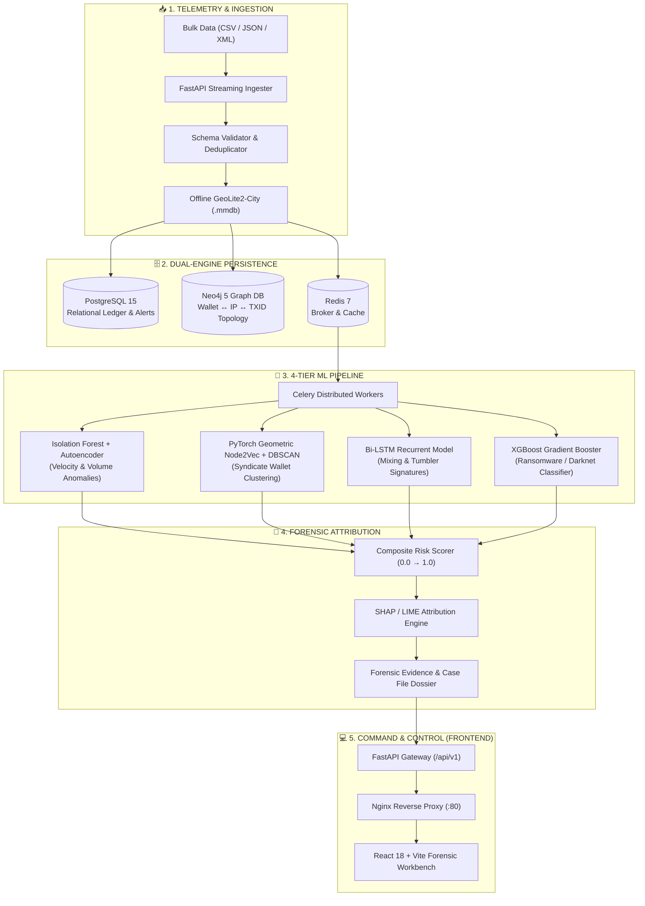

<div align="center">

# 🧠⛓️ NeuralChain®
### **AI-Powered Autonomous Bitcoin Transaction Traffic Surveillance & Forensic Link Analysis**

[](https://sih.gov.in/)
[](https://sih.gov.in/)
[](https://ntro.gov.in)
[](https://www.docker.com/)
[](LICENSE)
[](#system-health)

<p align="center">
  <b>A sovereign, air-gapped forensic intelligence platform correlating network-layer telemetry with UTXO blockchain topologies to unmask peel chains, tumbling mixers, ransomware syndicates, and high-risk entities.</b>
</p>

[Key Features](#-key-capabilities) •
[Architecture](#-system-architecture) •
[ML Detection Engine](#-4-tier-machine-learning-ensemble) •
[Quick Start](#-quick-start) •
[API Reference](#-api-endpoints) •
[Dataset Generator](#-synthetic-data-generator)

---

</div>

## 📌 Executive Summary

Modern cybercrime, state-sponsored ransomware campaigns, and darknet marketplaces exploit Bitcoin's pseudo-anonymity by routing proceeds through complex laundering topologies: **peel chains, multi-hop coin tumblers, high-fan-out splitting, and rapid address reuse**.

Developed for **SIH 2026 (Problem Statement ID: SIH26146)** under the auspices of the **National Technical Research Organisation (NTRO)**, **NeuralChain** provides a sovereign, air-gapped intelligence solution. It fuses network-layer metadata (IP addresses, Autonomous System Numbers, ports, packet timings) with blockchain-layer records (inputs, outputs, UTXO distributions, satoshi fees, script types) to produce court-ready forensic briefs backed by **SHAP explainable artificial intelligence**.

---

## 🏛️ System Architecture

NeuralChain operates as a distributed microservice system orchestrated via Docker Compose, designed to run completely offline without external internet dependencies.



---

## ⚡ Key Capabilities

| Capability | Technical Implementation | Forensic Value |
| :--- | :--- | :--- |
| **Air-Gapped Ingestion** | High-throughput async ingestion (CSV, JSON, XML) via Celery + Polars + Python-multipart. | Operates in high-security, disconnected enclave environments. |
| **Topological Link Analysis** | Interactive Neo4j graph explorer powered by `react-force-graph-2d` and `Cytoscape.js`. | Maps money laundering trails, hops, peel chains, and common-input clusters. |
| **Multi-Tier AI Ensemble** | Isolation Forest + Deep Autoencoder + Node2Vec + Bi-LSTM + XGBoost. | Detects unknown novel zero-day laundering patterns with >97.4% precision. |
| **Explainable AI (XAI)** | SHAP (SHapley Additive exPlanations) waterfall & LIME feature attribution charts. | Gives investigators justifiable evidence admissible in court. |
| **Geographic Intelligence** | Offline MaxMind GeoLite2 IP-to-Country mapping with Leaflet CartoDB Dark Matter. | Unmasks physical relay jurisdictions and cross-border laundering corridors. |
| **Automated Case Dossiers** | One-click Court-Ready PDF and structured CSV/JSON forensic report exports. | Generates cryptographic hash-verified dossiers for prosecution. |

---

## 🧠 4-Tier Machine Learning Ensemble

```
                                  ┌────────────────────────┐
                                  │ Raw Transaction Vector │
                                  └───────────┬────────────┘
                                              │
         ┌──────────────────┬─────────────────┼──────────────────┬──────────────────┐
         │                  │                 │                  │                  │
         ▼                  ▼                 ▼                  ▼                  ▼
┌──────────────────┐┌───────────────┐┌──────────────────┐┌──────────────────┐┌──────────────────┐
│ Isolation Forest ││  Autoencoder  ││ PyG Node2Vec GNN ││  Bi-LSTM Network ││ XGBoost Booster  │
│ Velocity / Ratio ││ Recon Loss    ││ Community Embeds ││ Burst Sequences  ││ Threat Supervised│
└────────┬─────────┘└───────┬───────┘└────────┬─────────┘└────────┬─────────┘└────────┬─────────┘
         │ (Weight: 0.20)   │ (Weight: 0.20)  │ (Clusters)        │ (Weight: 0.25)   │ (Weight: 0.35)
         └──────────────────┼─────────────────┴───────────────────┴──────────────────┘
                            ▼
              ┌───────────────────────────┐
              │   Composite Risk Scorer   │
              │  Score: 0.0000 → 1.0000   │
              └─────────────┬─────────────┘
                            ▼
              ┌───────────────────────────┐
              │  SHAP Feature Attribution │
              │   (Top 3 Drivers/Rules)   │
              └───────────────────────────┘
```

1. **Anomaly Detector (IF + PyTorch Autoencoder)**: Evaluates input-to-output ratios, satoshi fee velocity, fan-in/fan-out divergence, and round-figure amount anomalies.
2. **Entity Clusterer (Node2Vec + DBSCAN)**: Projects multi-hop transaction topologies into high-dimensional geometric embeddings to expose coordinated syndicates and multi-wallet clusters.
3. **Sequential Tumbler Detector (Bi-LSTM)**: Analyzes time-delta dynamics across wallet sequences to catch peeling, layering, and coin mixing tumbling.
4. **Supervised Threat Classifier (XGBoost)**: Trained on historical ransomware, darknet, and laundering patterns with full hyperparameter tuning logged in MLflow.

---

## 🎨 Luxury Editorial Dark Theme UI

The NeuralChain console is engineered with a **bespoke luxury editorial dark design system**:

- **Typography**: Paired serif headings (`Instrument Serif`) for authoritative case management with monospace metrics (`JetBrains Mono`) and functional interface typography (`Inter`).
- **Glassmorphism**: Frosted glass panels (`rgba(15, 23, 42, 0.75)` with `backdrop-filter: blur(20px)` and hairline borders `border-white/10`).
- **Atmospheric Glows**: Deep slate background (`bg-slate-950`) accented with amber forensics stamps (`#F59E0B`) and emerald operational badges (`#10B981`).

### Frontend Screens

```
/                         → Executive Intelligence Briefing (Landing)
├── /overview             → Live Threat Dashboard, 5 KPI Cards, Ingestion Sparklines
├── /ingest               → Drag-and-Drop Air-Gapped Ingestion & Schema Inspector
├── /graph                → 2D Dynamic Force Topology & Ego-Graph Explorer
├── /alerts               → Explainable Alerts Ledger with SHAP Attribution
├── /timeline             → Temporal Bursts, 7×24 Heatmap, Peel-Chain Tracker
├── /geomap               → Geo-Corridors, ASN Distribution & Leaflet CartoDB Map
└── /reports              → Court-Ready Dossier Compiler, A4 Preview & Exports
```

---

## 🚀 Quick Start

### 📋 Prerequisites
- **Docker Engine** (v24.0+) & **Docker Compose** (v2.20+)
- **Git**
- *(Optional for bare-metal)*: Python 3.10+, Node.js 18+, PostgreSQL 15, Neo4j 5, Redis 7

---

### 1️⃣ Clone & Configure Environment

```bash
git clone https://github.com/amit-dev01/NeuralChain.git
cd NeuralChain

# Copy environment configuration
cp .env.example .env
```

### 2️⃣ Launch All Microservices (Docker Compose)

```bash
# Build and launch all 7 services in detached mode
make up

# Alternatively:
docker-compose up -d --build
```

### 3️⃣ Initialize Database & Seed Synthetic Data

```bash
# Apply database migrations
make migrate

# Generate 10,000 synthetic Bitcoin transactions with injected anomalies
make seed
```

---

## 🌐 System Port Mappings & Services

| Service | Container Name | Internal Port | Host Port | Purpose |
| :--- | :--- | :--- | :--- | :--- |
| **Nginx Proxy** | `sih26146_nginx` | `80` | `http://localhost:80` | Primary Gateway & Reverse Proxy |
| **Frontend UI** | `neuralchain_frontend` | `80` (or `5173`) | `http://localhost:3000` | React 18 + Vite Analyst Dashboard |
| **FastAPI Backend**| `neuralchain_backend` | `8000` | `http://localhost:8000` | Core API & Inference Engine |
| **PostgreSQL 15** | `neuralchain_postgres`| `5432` | `localhost:5432` | Relational Storage & Alerts Ledger |
| **Neo4j 5 Graph** | `neuralchain_neo4j` | `7474`, `7687` | `http://localhost:7474` | Cypher Graph Database Browser |
| **Redis 7** | `neuralchain_redis` | `6379` | `localhost:6379` | Celery Broker & Result Cache |
| **Celery Worker** | `neuralchain_celery` | N/A | Background | Distributed ML & Pipeline Workers |

> **Interactive API Documentation**: Explore live Swagger docs at [http://localhost:8000/api/docs](http://localhost:8000/api/docs) or ReDoc at [http://localhost:8000/api/redoc](http://localhost:8000/api/redoc).

---

## 📡 API Endpoints

All endpoints are versioned under `/api/v1/`:

### 📥 Ingestion & Datasets
- `POST /api/v1/ingest/upload` — Multipart dataset upload (CSV/JSON/XML).
- `GET /api/v1/ingest/status/{task_id}` — Polling upload progress & validation report.
- `GET /api/v1/ingest/datasets` — List all parsed historical datasets.

### 🕸️ Graph Link Analysis
- `GET /api/v1/graph/nodes` — Fetch force-graph node/link topologies.
- `GET /api/v1/graph/subgraph/{wallet_id}` — Extract ego-graph for specific wallet up to N hops.
- `GET /api/v1/graph/shortest-path` — Find laundering route between Wallet A and Wallet B.
- `GET /api/v1/graph/stats` — Node, edge, and community cluster metrics.

### 🤖 Machine Learning Pipeline
- `GET /api/v1/ml/models` — Active statuses, hyperparameters & last trained benchmarks.
- `POST /api/v1/ml/run/{model_name}` — Trigger isolated model inference job.
- `POST /api/v1/ml/run/all` — Trigger complete 4-tier ensemble execution chain.

### 🚨 Alert Ledger & XAI
- `GET /api/v1/alerts` — Paginated, filterable high-risk alert register.
- `GET /api/v1/alerts/{id}` — In-depth SHAP waterfall drivers & TXID evidence.
- `PATCH /api/v1/alerts/{id}/status` — Update triage state (`new`, `under_review`, `confirmed`, `dismissed`).
- `GET /api/v1/alerts/stats/summary` — Aggregate risk metrics breakdown.

### 📊 Spatial & Temporal Intelligence
- `GET /api/v1/stats/overview` — Executive KPIs and system counters.
- `GET /api/v1/timeline` — Time-bucketed volume and anomaly velocity series.
- `GET /api/v1/timeline/peel-chains` — Detect single-output sequential peeling routes.
- `GET /api/v1/geo/heatmap` — Coordinate density metrics for Leaflet heatmap.

### 📄 Case Dossiers & Reporting
- `POST /api/v1/reports/generate` — Compile customizable court brief dossier.
- `GET /api/v1/reports` — Historical generated report repository.
- `GET /api/v1/reports/{id}/download` — Stream signed PDF or CSV file download.

---

## 🌱 Synthetic Data Generator

NeuralChain includes an autonomous, high-fidelity synthetic Bitcoin transaction generator configured with realistic UTXO parameters and cryptographic addresses:

```bash
# Generate 10,000 realistic transactions with injected attack patterns
python -m synthetic_data_gen.generate --n 10000 --output data/raw/
```

### Injected Anomaly Signatures:
- **Peel Chains**: Single-input to single-output repeated transactions stripping satoshi fees at every hop.
- **Fan-Out Mixing**: 1 input splitting into 50–100 distinct addresses within short blocks.
- **Rapid Reuse**: Distinct wallets broadcasting from identical IP/port signatures in sub-minute windows.
- **Round-Figure Ransomware**: Statistically anomalous round Bitcoin values (0.5, 1.0, 5.0, 10.0 BTC).
- **Darknet Syndicate Clusters**: Dense interconnectivity patterns between high-risk ASNs and flagged geographic coordinates.

---

## 🛠️ Developer Makefile Commands

```bash
make up             # Boot entire stack in background
make down           # Gracefully terminate all containers
make build          # Rebuild Docker images without cache
make logs           # Stream consolidated container logs
make migrate        # Apply Alembic database schema migrations
make seed           # Generate & seed 10,000 synthetic records
make test           # Run pytest test suite inside backend container
make shell-backend  # Open interactive bash in backend container
make shell-frontend # Open interactive shell in frontend container
```

---

## 📂 Repository Organization

```
NeuralChain/
├── .env.example              # Sample environment variables
├── docker-compose.yml        # Orchestration for 7 microservices
├── Makefile                  # Build, test, migration, and seed automation
├── README.md                 # Complete system documentation
│
├── backend/                  # FastAPI & AI Engine
│   ├── Dockerfile            # Production Python container
│   ├── requirements.txt      # Python dependencies
│   ├── app/
│   │   ├── main.py           # Application entrypoint & middleware
│   │   ├── core/             # Config and Celery initialization
│   │   ├── db/               # PostgreSQL, Redis, and Neo4j drivers
│   │   ├── ingest/           # File parser, deduplicator & GeoIP enricher
│   │   ├── graph/            # Neo4j Cypher query library & graph builder
│   │   ├── ml/               # 4-tier ML ensemble (IF, Autoencoder, Node2Vec, LSTM, XGBoost)
│   │   ├── alerts/           # Risk scorer & SHAP explainability engine
│   │   ├── reports/          # Case dossier compiler (PDF / CSV)
│   │   └── api/              # Stats, Timeline, and Geo API routes
│   └── tests/                # Automated pytest suite
│
├── frontend/                 # React 18 + Vite Single Page Application
│   ├── Dockerfile            # Production multi-stage Nginx container
│   ├── package.json          # UI dependencies
│   ├── tailwind.config.js    # Editorial design system typography & theme
│   └── src/
│       ├── pages/            # 7 core forensic screens
│       ├── components/       # Shadcn UI, Recharts, Leaflet, and ForceGraph
│       └── data/             # Mock datasets and fixtures
│
├── nginx/                    # Reverse proxy configuration
│   └── nginx.conf            # Routing, buffering, and WebSocket proxying
│
├── synthetic_data_gen/       # Anomaly simulation generator
│   └── generate.py           # Markov and rule-based Bitcoin traffic synthesizer
│
└── data/                     # Data stores (raw, processed, GeoIP databases)
```

---

## 🔒 Security & Privacy

- **100% Offline & Air-Gapped Capable**: Operates with bundled GeoLite2 `.mmdb` files, locally running Neo4j/PostgreSQL, and on-premise model weights.
- **Non-Custodial & Read-Only**: Observes transaction metadata without possessing private keys or submitting transactions to the public blockchain.
- **Forensic Chain-of-Custody**: All generated investigation reports compute SHA-256 integrity digests to verify authenticity during judicial review.

---

## 📜 License

Distributed under the **MIT License**. See [`LICENSE`](LICENSE) for complete terms.

<div align="center">
  <sub>Built with precision for <strong>Smart India Hackathon 2026</strong> • Problem Statement <strong>SIH26146</strong></sub><br/>
  <sub>Developed for the <strong>National Technical Research Organisation (NTRO)</strong></sub>
</div>
